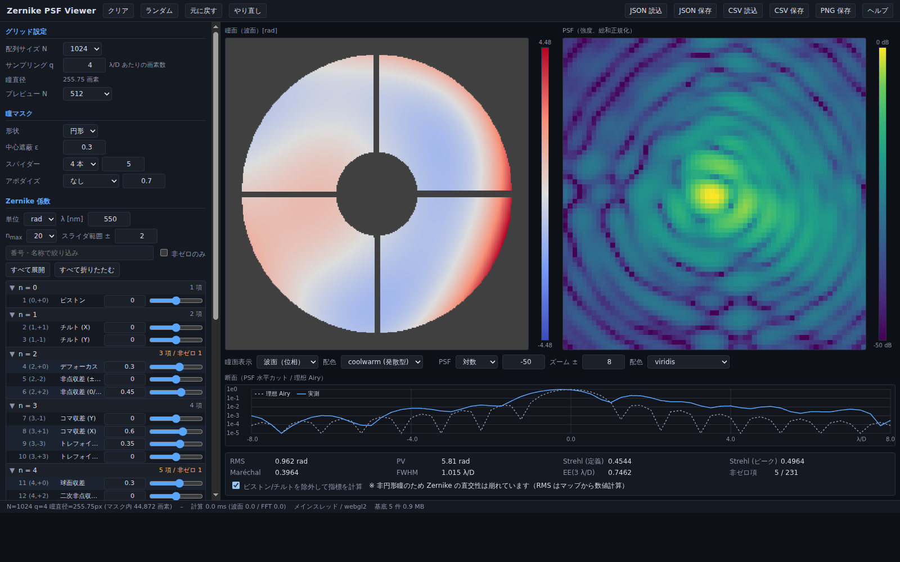

# misc

## Zernike PSF Viewer

Zernike 係数を GUI から入力し、瞳面（波面）と PSF をリアルタイムに表示する
Windows 向けツール。**配布物は HTML 1 ファイル**で、インストール・ランタイム・
管理者権限のいずれも不要。



### 使い方

[`dist/ZernikePsfViewer.html`](dist/ZernikePsfViewer.html) を任意のフォルダに置き、
ダブルクリックして既定ブラウザ（Edge / Chrome）で開く。

- Zernike の規約は [`torchmfbd/zern.py`](https://github.com/aasensio/torchmfbd/blob/main/src/torchmfbd/zern.py)
  に準拠（**Noll インデックス / Noll 正規化 / 位相は rad**）。最大 n = 20（Noll 1〜231）。
- 瞳関数 `P = A·exp(iW)` から `PSF = |FFT2(P)|²`（総和正規化）を計算する。
- 円形・矩形の瞳、中心遮蔽、スパイダー、ガウシアンアポダイゼーションに対応。
- RMS / PV / Strehl / Maréchal / FWHM / エンサークルドエネルギーを表示。
- 設定 JSON と係数 CSV の読み書き、PNG エクスポート。
  CSV 読込時は先頭要素に対応する Noll 番号を指定できる
  （torchmfbd のモード列はピストンを含まないため `2`）。

### 開発

Node と Python は開発時のみ必要。**npm の依存パッケージは無し**。

```
npm test              # 単体テスト（node --test、29 件）
npm run bench         # 性能マイクロベンチ
npm run build         # dist/ZernikePsfViewer.html を生成
node tools/smoke.mjs  # ヘッドレス Chromium で UI を操作して検証（23 項目）
npm run fixtures      # 参照 fixture の再生成（python3、numpy 不要）
```

### ドキュメント

- [仕様書](docs/zernike-psf-viewer/SPEC.md) — 技術選定、計算仕様、機能要件、
  データ仕様、テスト計画、実測性能、参照実装との突き合わせ手順
